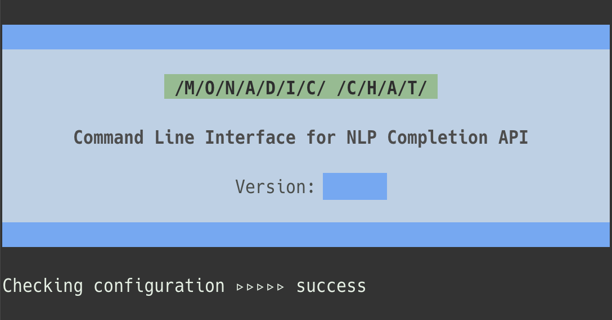

<p align="center"></p>

Highly configurable CLI client app for OpenAI chat/text-completion API

<p align="center"></p>


> **Note**
> This software is *under active development* and the latest version may behave slightly differently than this documentation. The specifications may change in the future.

## Table of Contents

<!-- vim-markdown-toc GFM -->

* [Introduction](#introduction)
* [Dependencies](#dependencies)
* [Installation](#installation)
  * [Using RubyGems](#using-rubygems)
  * [Clone the GitHub repository](#clone-the-github-repository)
* [Usage](#usage)
  * [Authentication](#authentication)
  * [Select Main Menu Item](#select-main-menu-item)
  * [Roles](#roles)
  * [System-Wide Functions](#system-wide-functions)
* [Apps](#apps)
  * [Chat](#chat)
  * [Code](#code)
  * [Novel](#novel)
  * [Translate](#translate)
* [Modes](#modes)
  * [Normal Mode](#normal-mode)
  * [Research Mode](#research-mode)
* [What is Research Mode?](#what-is-research-mode)
  * [How Research Mode Works](#how-research-mode-works)
  * [Accumulator](#accumulator)
  * [Reducer](#reducer)
* [Creating New Apps](#creating-new-apps)
  * [Folder/File Structure](#folderfile-structure)
  * [Reducer Code](#reducer-code)
  * [Template for `Normal` Mode](#template-for-normal-mode)
  * [Template for `Research` Mode](#template-for-research-mode)
* [What is Monadic about Monadic Chat?](#what-is-monadic-about-monadic-chat)
  * [Unit, Bind, and Join](#unit-bind-and-join)
  * [Discourse Management Object](#discourse-management-object)
* [Future Plans](#future-plans)
* [References](#references)
* [Contributing](#contributing)
* [Author](#author)
* [License](#license)

<!-- vim-markdown-toc -->

## Introduction

**Monadic Chat** is a command-line client application program that uses OpenAI's Text Completion API and Chat API to enable chat-style conversations with OpenAI's artificial intelligence system in a ChatGPT-like style.

The conversation with the AI can be saved in a JSON file, and the saved JSON file can be loaded later to continue the conversation. The conversation data can also be converted to HTML format and displayed in a web browser.

Monadic Chat comes with four apps (`Chat`, `Code`, `Novel`, and `Translate`). Each can generate a different kind of text through interactive conversation between the user and OpenAI's large-scale language model. Users can also create their own apps.

## Dependencies

- Ruby 2.6.10 or greater
- OpenAI API Token
- A command line terminal app such as:
  - Terminal or [iTerm2](https://iterm2.com/) (MacOS)
  - [Windows Terminal](https://apps.microsoft.com/store/detail/windows-terminal) (Windows 11)
  - GNOME Terminal (Linux)
  - [Alacritty](https://alacritty.org/) (Multi-platform)

## Installation

### Using RubyGems

Execute the following command in an environment where Ruby 2.6 or higher is installed.

```text
gem install monadic-chat
```

### Clone the GitHub repository

Alternatively, clone the code from the GitHub repository and follow the steps below. At this time, you must take this option to create a new app for Monadic Chat.

1. Clone the repo

```text
git clone https://github.com/yohasebe/monadic-chat.git
```

2. Install dependencies

```text
cd monadic-chat
bundle update
```

3. Grant permission to the executable file

```text
chmod +x ./bin/monadic
```

4. Run the executable file

```text
./bin/monadic
```

## Usage

### Authentication

When you start Monadic Chat with the `monadic` command for the first time, you will be asked for an OpenAI access token. If you do not have one, create an account on the [OpenAI](https://platform.openai.com/) website and obtain an access token.

If the environment variable `OPENAI_API_KEY` is set in the system, its value will be used automatically.


Once the correct access token is verified, the access token is saved in the configuration file below and will automatically be used the next time the app is started.

`$HOME/monadic_chat.conf`

### Select Main Menu Item

Upon successful authentication, a menu to select a specific app will appear. Each app generates different types of text through an interactive chat-style conversation between the user and the AI. Four apps are available by default: [`chat`](#chat), [`code`](#code), [`novel`](#novel), and [`translate`](#translate).

By selecting the `mode` menu item, you can change the [modes](#modes) from `normal` to `research` and vice versa.

Selecting `readme` will take you to the README on the Github repository (which is the document you are looking at now). Selecting `quit` will exit Monadic Chat.


In the main menu, you can use the cursor keys and the enter key to make a selection. You can also narrow down the choices each time you type a letter.

### Roles

Each message in the conversation is labeled with one of three roles: `User`, `GPT`, or `System`.

- `User`: messages from the user of the Monadic Chat app (that's you!)
- `GPT`: messages from the OpenAI large-scale language model
- `System`: messages from the Monadic Chat system

### System-Wide Functions

You can call up the function menu anytime. To invoke the function menu, type `help` at the prompt or press `CTRL-L`.


In the function menu, you can use the cursor keys and the enter key to make a selection. You can also narrow down the choices each time you type a letter. Some functions are given multiple names so that typing on the keyboard will quickly bring up the function you need.

**params/settings/config**

You can set parameters to be sent to OpenAI's APIs. The items that can be set are listed below. 

- `model`
- `max_tokens`
- `temperature`
- `top_p`
- `frequency_penalty`
- `presence_penalty`

For detailed information on each parameter, please refer to OpenAI's [API Documentation](https://platform.openai.com/docs/). The default value of each parameter depends on the individual "mode" and "app".

**data/context**

In `normal` mode, running this function only displays the history of conversation so far between User and GPT. In `research` mode, meta-data (e.g. topics, language being used, number of turns) values are presented.

In `research` mode, it may take a while (usually several seconds) after the `data/context` command is executed before the data is displayed. This is because in `research` mode, even after displaying a direct response to user input, there may be a process running in the background that retrieves the context data and reconstructs it.

**html**

All the information retrievable by running `data/context` function can be presented in an HTML format. The HTML file is automatically opened in the default web browser.


In `research` mode, it may take several seconds to several minutes after the `html` command is executed before the acutal HTML is displayed. This is because in `research` mode, even after displaying a direct response to user input, there may be a process running in the background that retrieves and reconstructs the context data, requiring the system to wait for it to finish.

**reset**

You can reset all the conversation history (messages by both User and GPT). Note that API parameter settings will be reset to default as well.

**save and load**

The conversation history (messages by both User and GPT, and meta data in `research` mode) can be saved as a JSON file in a path you specify. Note that the saved file can only be read by the same application that saved it.

**clear/clean**

Selecting this, you can scroll and clear the screen so that the cursor is at the top.

**readme/documentation**

The README page on the Github repository (which is the document you are looking at now) will be opened.

**exit/bye/quit**

Selecting this will exit the current app and return to the main menu.

## Apps

### Chat

Monadic Chat's `chat` app is the most basic and generic app among others offered by default.


As with ChatGPT, there can be many variations in the content of the conversation. In the `chat` app, OpenAI's large-scale language model acts as a competent assistant that can do anything. It can write computer code, create fiction and poetry texts, and translate texts from one language into another. Of course, it can also engage in casual or academic discussions on specific topics.

- [`normal` mode template for `chat` app in JSON](https://github.com/yohasebe/monadic-chat/blob/main/apps/chat/chat.json)
- [`research` mode template for `chat` app in Markdown](https://github.com/yohasebe/monadic-chat/blob/main/apps/chat/chat.md)


### Code

Monadic Chat's `code` is designed to be an app that can write computer code for you.


In the `code` app, OpenAI's GPT behaves as a competent software engineer. The main difference from the `chat` app is that the `temperature` parameter is set to `0.0`, so that as less randomness as possible is introduced to the responses. Syntax highlighting is applied (where possible) to the program code in the result message. The same is true for the output via the `html` command available from the functions menu.

- [`normal` mode template for `code` app in JSON](https://github.com/yohasebe/monadic-chat/blob/main/apps/code/code.json)
- [`research` mode template for `code` app in Markdown](https://github.com/yohasebe/monadic-chat/blob/main/apps/code/code.md)

### Novel

Monadic Chat's `novel` is designed to help you develop novel plots; the app instructs OpenAI's GPT model to write text based on a topic, theme, or brief description of an event indicated in the user prompt. Each new response is based on what was generated in previous responses. The intaractive nature of the app allows the user to control the plot development, rather than having an AI agent create a new novel all at once.

- [`normal` mode template for `novel` app in JSON](https://github.com/yohasebe/monadic-chat/blob/main/apps/novel/novel.json)
- [`research` mode template for `novel` app in Markdown](https://github.com/yohasebe/monadic-chat/blob/main/apps/novel/novel.md)

### Translate

Monadic Chat's `translate` is an app that helps translate text written in one language into another. Rather than translating the entire text at once, the app allows users to work sentence by sentence, or paragraph by paragraph.

The translation preferred to be used for a given expression is specified in a pair of parentheses ( ) right after the original expression in question in a pair of brackets [ ] in the source text.


Sometimes, however, problematic translations are created. The user can "save" the set of source and target texts and make any necessary corrections. By passing the corrected translation data to the app, the same unwanted expressions can be prevented or avoided later.

- [`normal` mode template for `translate` app in JSON](https://github.com/yohasebe/monadic-chat/blob/main/apps/translate/translate.json)
- [`research` mode template for `translate` app in Markdown](https://github.com/yohasebe/monadic-chat/blob/main/apps/translate/translate.md)

## Modes

Monadic Chat has two modes. The `normal` mode utilizes OpenAI's chat API to achieve ChatGPT-like functionality. It is suitable for a casual use of a large language model as a competent companion for various purposes. On the other hand, `research` mode utilizes OpenAI's text-completion API. This mode allows acqure various metadata in the background while receiving the main response at each turn of the conversation. It may be especially useful for researchers exploring the possibilities of large-scale language models and their applications.

### Normal Mode

The default language model for `normal` mode is `gpt-3.5-turbo`.

In the default configuration, after 10 turns, the dialogue messages are reduced by deleting the oldest ones (but not the messages that the `system` role gave as instructions).

### Research Mode

The default language model for `research` mode is `text-davinci-003`.

Although the text-completion API is not a system optimized for chat-style dialogue, it can be used in conjunction with a mechanism that keep track of the conversation history in a monadic structure to realize a dialogue system. Such a mechanism also has the advantage that various metadata can be retrieved at each turn of the dialogue.
By default, when the number of tokens in the response from the GPT (which increases with each iteration because of the conversation history) reaches a certain value, the oldest message is deleted.

If you wish to specify how the conversation history is handled as the interaction with the GPT model unfolds, you can do so by writing a `Proc` object containing Ruby code. Since various meta-data are available in this mode, finer-grained control is possible.

## What is Research Mode?

Monadic Chat's `research` mode has the following advantages:

- In `research` mode, each turn of the conversation can capture **metadata** as well as the **main responses**
- You can define the **accumulator** and **reducer** mechanism and control the **flow** of the conversation
- It has structural features that mimic the **monadic** nature of natural language discourse

There are some drawbacks, however:

- It uses OpenAI's `text-davinci-003` model and the response text from this model is not as detailed as in the `normal` mode that uses `gpt-3.5-turbo`.
- After displaying a response message from GPT, contextual information is processed in the background, which can cause lag when displaying conversation history in the command line screen or in HTML output.
- Templates for `research` mode are larger and more complex and it requires more efort to create and fine-tune.
- `Research` mode requires larger input/output data and consumes more tokens than in `normal` mode.
- Compared to the chat API used in `normal` mode, the text-completion API used in `research` mode is more expensive.

For these reasons, `normal` mode is recommended for daily use, but it is the `research` mode that makes Monadic Chat different from other similar products as discussed below.

### How Research Mode Works

Below is a schematic illustration of the interaction with the API in `research` mode.


The terms shown in bold in the figure are explained below.

- **Input** is a string entered by the user on the command line. The input is sent to the API as a replacement for the `{{NEW PROMPT}}` placeholder in the template.
- The **template** contains conversation data in JSON format and instructions on how this data should be updated by the text-completion API. More details are given in the [Creating New Apps]("#creating-new-apps") section below.
- **prompt** can be used in two different ways: in one sense, it means text input from the user. In the figure above, however, "prompt" refers to the contents of the template as a whole, which is sent to the API.
- The text-completion API returns a JSON object in the format specified in the template. The response to the user's **input** is referred to as **output**, both of which are contained in the returned JSON object. The result data from the text-completion API consists of an updated version of the given JSON object, one that is modified according to the instruction and the user's input contained in the template.
- The JSON object contains a list of the conversation history, which is referred to as the **accum** (accumulator) in the figure. Each turn of the conversation accumulates the exchange stored in the accumulator.
- To prevent the accumulator from swelling excessivly, a **reducer** must be defined in the Monadic Chat app. For example, The reducer will delete old exchanges when the number of turns exceeds a certain number, for instance.

### Accumulator

The `normal` mode uses OpenAI's chat API, where the following structure must be used for conversation history management.

```json
{"messages": [
  {"role": "system", "content": "You are a friendly but professional consultant who answers various questions ... "},
  {"role": "user", "content": "Can I ask something?"},
  {"role": "assistant", "content": "Sure!"}
]}
```
The `research` mode accumulator is similar to this in form.

### Reducer

Currently the reducer mechanism must be implemented in Ruby code for each app. In many cases, it would be sufficient to keep the size of the accumulator within a certain range by deleting old messages when a certain number of conversation turns are reached. Other possible implementations include the following.

**Example 1**

- Retrieve the current conversation topic as metadata at each turn and delete old exchanges if the conversation topic has changed.
- Even if the old exchange is deleted, the metadata about the conversation topic should be retained in list form.

**Example 2**

- At the end of a given turn, the reducer writes the history of the conversation up to that point to an external file and delete it from the accumulator. - A summary of the deleted content is put back into the accumulator as an annotation with the `system` role, and the conversation continues.

**Example 2**

- After a certain number of turns, the reducer writes the history of the conversation up to that point to an external file and delete it from the accumulator.
- A summary of the deleted content is returned to the accumulator as an annotation message by the `system`, and the conversation continues with that summary information as context.

The Ruby implementation of "reducer" mechanism for each default app can be found below:

- [Chat](https://github.com/yohasebe/monadic-chat/blob/main/apps/chat/chat.rb)
- [Code](https://github.com/yohasebe/monadic-chat/blob/main/apps/code/code.rb)
- [Novel](https://github.com/yohasebe/monadic-chat/blob/main/apps/novel/novel.rb)
- [Translation](https://github.com/yohasebe/monadic-chat/blob/main/apps/translation/translation.rb)

## Creating New Apps

This section describes how users can create their own original Monadic Chat app.

As an example, we create an app named `linguistic`. It will do the following for the input sentence from the user *all at the same time* :

- Display the results of syntactic analysis as a main response
- Classify syntactic types ("declarative", "interrogative", "imperative", "exclamatory", etc.)
- Perform sentiment analysis ("happy", "sad", "troubled", "sad ", etc.)
- Write a piece of text summarizing the user's input up to the point

The specifications for the command line user interface are as follows

- Sentences to be parsed must be enclosed in double quotes so that the AI does not take the input as some kind of direction
- How to process inputs that are not enclosed in double quotes is left to the AI
- Syntactically analyzed data shall be formatted in Penn Treebank format. However, square brackets [ ] are used instead of parentheses ( ).
- Syntactically analyzed data will be returned in the form of Markdown inline code

The use of square brackets in the notation of syntactic analysis here is to conform to the format of [RSyntaxTree](https://yohasebe.com/rsyntaxtree), a tree-drawing program for linguistic research developed by the author of Monadic Chat.

### Folder/File Structure

Monadic Chat apps are placed in the `apps` folder. The folders and files for default apps `chat`, `code`, `novel` and `translate` are also placed in this folder. To create a new app, create a new folder inside `apps`.

```text
apps
├── chat
│   ├── chat.json
│   ├── chat.md
│   └── chat.rb
├── code
│   ├── code.json
│   ├── code.md
│   └── code.rb
├── novel
│   ├── novel.json
│   ├── novel.md
│   └── novel.rb
└─── translate
    ├── translate.json
    ├── translate.md
    └── translate.rb
```

Notice in the figure above that three files with the same name but different extensions (`.rb`, `.json`, and `.md`) are stored under their respective folders. Similarly, when creating a new app, you create these three types of files under a folder with the same name as the app name.

```text
apps
└─── linguistic
    ├── linguistic.json
    ├── linguistic.md
    └── linguistic.rb
```

The purpose of each file is as follows.

- `linguistic.rb`: Ruby code to define the "reducer"
- `linguistic.json`:JSON template file describing GPT behavior in `normal` mode
- `linguistic.md`:Markdown template file describing GPT behavior in `research` mode

The `.rb` file is required, but you may create both `.json` and `.md` files, or only one of them. See the next section on how to write these files. Folders beginning with `_` and their contents are ignored. Template files with a name beginning with `_` are also ignored.

### Reducer Code

For our purposes, we do not need to make the reducer do anything special. So, copy the code from the default `Chat` app, make a small modification such as changing the class name, and save it as `apps/linguistic/linguistic.rb`.

### Template for `Normal` Mode

In `normal` mode, it is difficult to achieve all the necessary functions shown earlier. However, it is possible to define requirements for the user interface and display the results of syntactic analysis. Create a JSON file `apps/linguistic/linguistic.rb` and save it with the following contents:

```json
{"messages": [
  {"role": "system",
   "content": "You are a syntactic parser for natural languages. Analyze the given input sentence from the user and execute a syntactic parsing. Give your response in a variation of the penn treebank format, but use brackets [ ] instead of parentheses ( ). Also, give your response in a markdown code span. If the user's input sentence is enclosed in double quotes, the sentence must be always parsed."},
  {"role": "user", "content": "\"We saw a beautiful sunset.\""},
  {"role": "assistant",
   "content": "`[S [NP He] [VP [V saw] [NP [det a] [N' [Adj beautiful] [N sunset] ] ] ] ]`"},
  {"role": "user", "content": "\"We didn't take a picture.\"" },
  {"role": "assistant",
   "content": "`[S [NP We] [IP [I didn't] [VP [V take] [NP [Det a] [N picture] ] ] ] ] ]`"}
]}
```

This is exactly the specification specified in [OpenAI's chat API](https://platform.openai.com/docs/guides/chat). In fact, Monadic Chat's `normal` mode is just a client application that uses this API to achieve ChatGPT-like functionality on the command line.

### Template for `Research` Mode

The template in `research` mode is a Markdown file consisting of five sections. The role and content of each section is shown in the following figure.


Below we will look at the `research` mode template for the `linguistic` app, section by section.

**Main Section**

<div style="highlight highlight-source-gfm"><pre style="white-space : pre-wrap !important;">You are a natural language syntactic/semantic/pragmatic analyzer. Analyze the new prompt from the user below and execute a syntactic parsing. Give your response in a variation of the penn treebank format, but use brackets [ ] instead of parentheses ( ). Also, give your response in a markdown code span. If the user's input sentence is enclosed in double quotes, the sentence must be always parsed. Create a response to the following new prompt from the user and set your response to the "response" property of the JSON object shown below. All prompts by "user" in the "messages" property are continuous in content.
</pre></div>

The text content here is essentially the same as the text included in the template for the `normal` mode in an instruction message by `system`. However, note that it contains an instruction that the response from GPT through the API should be presented in the form of a JSON object as shown below.

**New Prompt**

```markdown
NEW PROMPT: {{PROMPT}}
```

Monadic ChatはテンプレートをAPIを通じて送るときに`{{PROMPT}}`をユーザーからの入力で置き換えます。

**JSON Object**

```json
{
  "prompt": "\"We didn't have a camera.\"",
  "response": "`[S [NP We] [VP [V didn't] [VP [V have] [NP [Det a] [N camera] ] ] ] ] ]`\n\n###\n\n",
  "mode": "parsing",
  "turns": 2,
  "sentence_type": ["declarative"],
  "sentiment": ["sad"],
  "summary": "The user saw a beautiful sunset, but did not take a picture because the user did not have a camera.",
  "tokens": 351,
  "messages": [{"user": "\"We saw a beautiful sunset.\"", "assistant": "`[S [NP He] [VP [V saw] [NP [det a] [N' [Adj beautiful] [N sunset] ] ] ] ]`\n\n###\n\n" },
               {"user": "\"We didn't take a picture.\"", "assistant": "`[S [NP We] [IP [I didn't] [VP [V take] [NP [Det a] [N picture] ] ] ] ] ]`\n\n###\n\n" },
               {"user": "\"We didn't have a camera.\"", "assistant": "`[S [NP We] [IP [I didn't] [VP [V have] [NP [Det a] [N camera] ] ] ] ] ]`\n\n###\n\n" }
              ]
}
```

This is the core part of the `research` mode template. Note that the entire `research` mode template is written in Markdown format, so the above JSON object is actually separated from the rest of the template by a code fence as shown below.

    ```json
    {
      "prompt": ...
      ...
      "messages": ...
    }
    ```

The required properties of this JSON object are `prompt`, `response`, and `messages`. Other properties are optional. The format of the `messages` property is similar to that of the `normal` mode (i.e., OpenAI's chat API), but it is structured as a list of objects whose keys are `user` and `assistant` to make it easier to describe.

**Content Requirements**

```markdown
Make sure the following content requirements are all fulfilled:

- keep the value of the "mode" property at "parsing"
- set the new prompt to the "prompt" property
- create your response to the new prompt in accordance with the "messages" and set it to "response"
- insert both the new prompt and the response after all the existing items in the "messages"
- analyze the new prompt's sentence type and set a sentence type value such as "interrogative", "imperative", "exclamatory", or "declarative" to the "sentence_type" property
- analyze the new prompt's sentiment and set one or more sentiment types such as "happy", "excited", "troubled", "upset", or "sad" to the "sentiment" property
- summarize the user's messages so far and update the "summary" property with a text less than 100 words.
- update the value of "tokens" with the number of tokens of the resulting JSON object"
- increment the value of "turns" by 1 and update the property so that the value of "turns" equals the number of the items in the "messages" of the resulting JSON object
```

Note that all the properties of the JSON object above are mentioned here and how GPT should update them is clearly specified.

**Formal Requirements**

```markdown
Make sure the following formal requirements are all fulfilled:

- do not use invalid characters in the JSON object
- escape double quotes and other special characters in the text values in the resulting JSON object
- add "\n\n###\n\n" at the end of the "response" value.
- wrap the JSON object with "<JSON>\n" and "\n</JSON>".
```

It contains the details on the format of the response returned through the API. JSON is essentially text data, and some characters must be properly escaped. Also, since the language model available in OpenAI's text-completion API is subject to some indeterminancy (even when the `temperature` parameter is `0.0`), to ensure that Monadic Chat receives the JSON object as reliably as possible, Monadic Chat requires `< JSON>... </JSON>` tags to enclose the whole JSON data.

Currently, Monadic Chat requires that the main response to user input end with the string `\n\n####\n\n`. This is part of the mechanism to detect when the response string sent by the streaming API reaches the end and display the response to the user as soon as possible. (The boundary string may be changed in the future.)

## What is Monadic about Monadic Chat?

A monad is a type of data structure in functional programming (leaving aside for the moment the notion of monad in mathematical category theory). An element with a monadic structure can be manipulated in a certain way to change its internal data. However, no matter how much the internal data changes, the external structure of the monadic element remains the same and can be manipulated in exactly the same way as it was at first.

We are surrounded by many such monadic entities, and natural language discourse is one of them. A "chat" between a human user and an AI can be thought of as a form of natural language discourse, which is monadic in nature. If so, an application that provides an interactive interface to a large-scale language model, such as ChatGPT, would most naturally be designed in a "functional" way, taking into account the monadic nature of natural language discourse.

### Unit, Bind, and Join

There are many "functional" programming languages, such as Haskell, that have monads as a core feature. However, Monadic Chat was developed using the Ruby programming language. This is because with Ruby, it would be easier for users to write their own apps (in the author's rather subjective opinion). It is true that Ruby, which incorporates some features of functional languages, is not classified as a "functional language." Monadic Chat has the following three features required of a monad, and in this sense, it can be considered "monadic."

- ***unit*** : a monad framework has a means of taking data and enclosing it in a monad structure
- ***bind*** : a monadic framework has a means of performing some operation on the data and enclosing the result in a monad structure
- ***join*** : a monad framework has a means of flattening a structure with multiple monad layers into a single layer

### Discourse Management Object

In Monadic Chat's `research` mode, a discourse management object described in JSON serves as an environment for managing and unfolding a conversation between the user and the large language model. Any sample data of user-AI interaction can be wrapped inside the JSON environment (***unit***).

The interaction between the user and the AI can be interpreted as a kind of operation on the *discourse world* built by the previous conversational exchanges. Monadic Chat updates the discourse worldby retrieving the dialogue data embedded in the template and performing operations in response to user input (***bind***).

Responses from OpenAI's language model APIs (chat API and text-completion API) are also returned in the same JSON format. The main conversational response content is wrapped within this environment. If the whole object were treated as the conversational response to the user input, the discourse management object would involve a nested structure and the same could continue inifinitively. Therefore, Monadic Chat extract only the necessary values from the response object reassemble the (single-layered) discourse management object using them (***join***).

## Future Plans

- More test cases to verify command line user interaction behavior
- Improved error handling mechanism to catch incorrect responses from GPT
- Develop a DSL to define templates in a more efficient and systematic manner
- Develop scaffolding capabilities to quickly build new apps

## References

I would appreciate it if you would use one of the following Bibtex entries when referring to Monadic Chat.

```
@misc{hasebe_2023a,
  author = {Yoichiro Hasebe},
  title = {Highly configurable CLI client app for OpenAI's chat/text-completion API},
  url = {https://github.com/yohasebe/monadic-chat},
  year = {2023}
}
```

```
@inproceedings{hasebe_2023b,
  author = {長谷部陽一郎},
  title = {Monadic Chat：テキスト補完APIで文脈を保持するためのフレームワーク},
  booktitle = {言語処理学会第29回年次大会発表論文集},
  url = {https://www.anlp.jp/proceedings/annual_meeting/2023/pdf_dir/Q12-9.pdf},
  year = {2023},
  pages = {3138--3143}
}
```

## Contributing

Bug reports and pull requests are welcome on GitHub at [https://github.com/yohasebe/monadic_chat]([https://github.com/yohasebe/monadic_chat]).

## Author

Yoichiro Hasebe

[yohasebe@gmail.com](yohasebe@gmail.com)

## License

The gem is available as open source under the terms of the [MIT License](https://opensource.org/licenses/MIT).
