<p align="center"></p>

<p align="center"><b>Highly configurable CLI client app for OpenAI chat/text-completion API</b></p>

<p align="center">

</p>

> **Warning**  
> This software is ***under active development***. It may be unstable, and the latest version may behave slightly differently than this document. Also, specifications may change in the future.

**Change Log**

- [March 13, 2023] Text on the architecture of the `research` mode updated in accordance with Version 0.2.0

## Table of Contents

<!-- vim-markdown-toc GFM -->

* [Introduction](#introduction)
* [Dependencies](#dependencies)
* [Installation](#installation)
    * [Using RubyGems](#using-rubygems)
    * [Clone the GitHub Repository](#clone-the-github-repository)
* [Usage](#usage)
    * [Authentication](#authentication)
    * [Select Main Menu Item](#select-main-menu-item)
    * [Roles](#roles)
    * [System-Wide Functions](#system-wide-functions)
* [Apps](#apps)
    * [Chat](#chat)
    * [Code](#code)
    * [Novel](#novel)
    * [Translate](#translate)
* [Modes](#modes)
    * [Normal Mode](#normal-mode)
    * [Research Mode](#research-mode)
* [What is Research Mode?](#what-is-research-mode)
    * [How Research Mode Works](#how-research-mode-works)
    * [Accumulator](#accumulator)
    * [Reducer](#reducer)
* [Creating New App](#creating-new-app)
    * [File Structure](#file-structure)
    * [Reducer Code](#reducer-code)
    * [Monadic Chat Template](#monadic-chat-template)
    * [Extra Template for `Research` Mode](#extra-template-for-research-mode)
* [What is Monadic about Monadic Chat?](#what-is-monadic-about-monadic-chat)
    * [Unit, Map, and Join](#unit-map-and-join)
    * [Discourse Management Object](#discourse-management-object)
* [Future Plans](#future-plans)
* [Bibliographical Data](#bibliographical-data)
* [Acknowledgments](#acknowledgments)
* [Contributing](#contributing)
* [Author](#author)
* [License](#license)

<!-- vim-markdown-toc -->

## Introduction

**Monadic Chat** is a command-line client application program that uses OpenAI's Text Completion API and Chat API to enable chat-style conversations with OpenAI's artificial intelligence system in a ChatGPT-like style.

The conversation with the AI can be saved in a JSON file, and the saved JSON file can be loaded later to continue the conversation. The conversation data can also be converted to HTML and displayed in a web browser.

Monadic Chat comes with four apps (`Chat`, `Code`, `Novel`, and `Translate`). Each can generate a different kind of text through interactive conversation between the user and OpenAI's large-scale language model. Users can also create new apps.

## Dependencies

- Ruby 2.6.10 or greater
- OpenAI API Token
- A command line terminal app such as:
  - Terminal or [iTerm2](https://iterm2.com/) (MacOS)
  - [Windows Terminal](https://apps.microsoft.com/store/detail/windows-terminal) (Windows 11)
  - GNOME Terminal (Linux)
  - [Alacritty](https://alacritty.org/) (Multi-platform)

## Installation

### Using RubyGems

Execute the following command in an environment where Ruby 2.6.10 or higher is installed.

```text
gem install monadic-chat
```

Then run the command to start the app:
```text
monadic-chat
```

To update:

```text
gem update monadic-chat
```

### Clone the GitHub Repository

Alternatively, clone the code from the GitHub repository and follow the steps below. At this time, you must take this option to create a new app for Monadic Chat.

1. Clone the repo

```text
git clone https://github.com/yohasebe/monadic-chat.git
```

2. Install dependencies

```text
cd monadic-chat
bundle update
```

3. Grant permission to the executable

```text
chmod +x ./bin/monadic-chat
```

4. Run the executable

```text
./bin/monadic-chat
```

## Usage

### Authentication

When you start Monadic Chat with the `monadic-chat` command for the first time, you will be asked for an OpenAI access token. If you do not have one, create an account on the [OpenAI](https://platform.openai.com/) website and obtain an access token.

<br />

<kbd></kbd>

<br />

Once the correct access token is verified, the access token is saved in the configuration file below and will automatically be used the next time the app is started.

`$HOME/monadic_chat.conf`

### Select Main Menu Item

Upon successful authentication, a menu to select a specific app will appear. Each app generates different types of text through an interactive chat-style conversation between the user and the AI. Four apps are available by default: [`chat`](#chat), [`code`](#code), [`novel`](#novel), and [`translate`](#translate).

Selecting the `mode` menu item allows you to change the [modes](#modes) from `normal` to `research` and vice versa.

Selecting `readme` will take you to the README on the GitHub repository (the document you are looking at now). Selecting `quit` will exit Monadic Chat.

<br />

<kbd>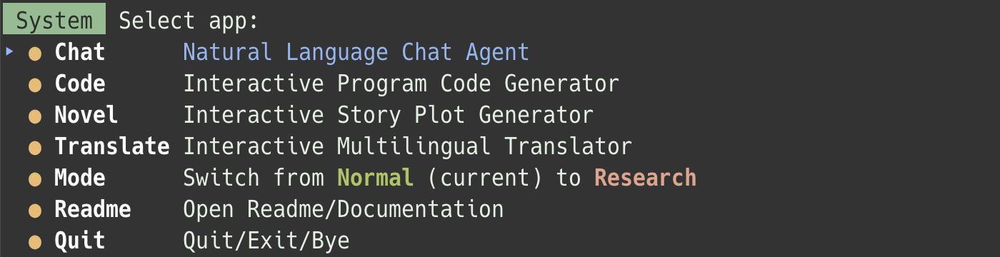</kbd>

<br />

In the main menu, you can use the cursor keys and the enter key to make a selection. You can also narrow down the choices each time you type a letter.

### Roles

Each message in the conversation is labeled with one of three roles: `User`, `GPT`, or `System`.

- `User`: messages from the user of the Monadic Chat app (that's you!)
- `GPT`: messages from the OpenAI large-scale language model
- `System`: messages from the Monadic Chat system

### System-Wide Functions

You can call up the function menu anytime. To invoke the function menu, type `help` or `menu`.

<br />

<kbd>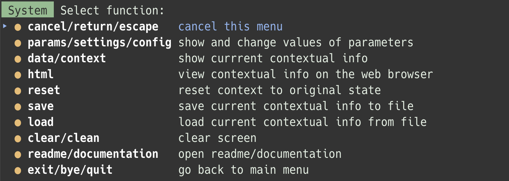</kbd>

<br />

In the function menu, you can use the cursor keys and the enter key to make a selection. You can also narrow down the choices each time you type a letter. Some functions are given multiple names, so typing on the keyboard quickly locates the necessary function.

**params/settings/config**

You can set parameters to be sent to OpenAI's APIs. The items that can be set are listed below. 

- `model`
- `max_tokens`
- `temperature`
- `top_p`
- `frequency_penalty`
- `presence_penalty`

For detailed information on each parameter, please refer to OpenAI's [API Documentation](https://platform.openai.com/docs/). The default value of each parameter depends on the individual "mode" and "app."

**data/context**

In `normal` mode, this function only displays the conversation history between User and GPT. In `research` mode, metadata (e.g., topics, language being used, number of turns) values are presented.

In `research` mode, it may take a while (usually several seconds) after the `data/context` command is executed before the data is displayed. This is because in `research` mode, even after displaying a direct response to user input, there may be a process running in the background that retrieves the context data and reconstructs it.

**html**

All the information retrievable by running the `data/context` function can be presented in HTML. The HTML file is automatically opened in the default web browser.

The generated HTML will be saved in the user’s home directory (`$HOME`) with the file `monadic_chat.html`. Once the `html` command is executed, the file contents will continue to be updated until you `reset` or quit the running app. Reload the browser tab or rerun the `html` command to show the latest data. HTML data is written to this file regardless of the app.

In `research` mode, it may take several seconds to several minutes after the `html` command is executed before the acutual HTML is displayed. This is because in `research` mode, even after displaying a direct response to user input, there may be a process running in the background that retrieves and reconstructs the context data, requiring the system to wait for it to finish.

**reset**

You can reset all the conversation history (messages by both User and GPT). Note that API parameter settings will be reset to default as well.

**save and load**

The conversation history (messages by both User and GPT, and metadata in `research` mode) can be saved as a JSON file in a specified path. Note that the saved file can only be read by the same application that saved it in the `research` mode.

**clear/clean**

Selecting this, you can scroll and clear the screen so that the cursor is at the top.

**readme/documentation**

The README page on the GitHub repository (the document you are looking at now) will be opened.

**exit/bye/quit**

Selecting this will exit the current app and return to the main menu.

## Apps

### Chat

Monadic Chat's `chat` app is the most basic and generic app among others offered by default.

<br />

<kbd>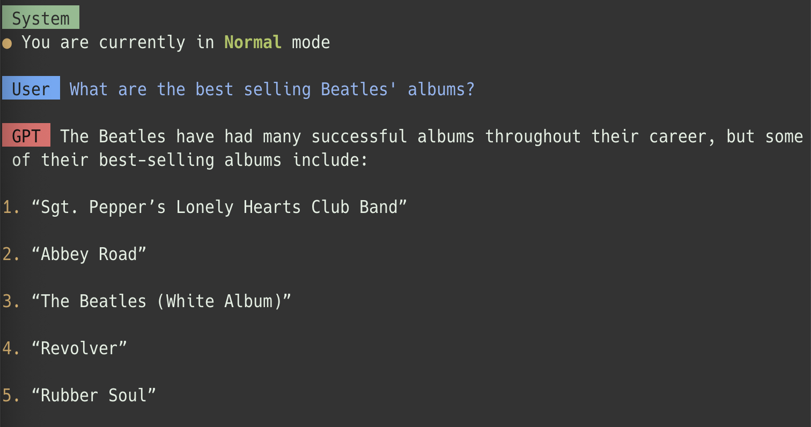</kbd>

<kbd>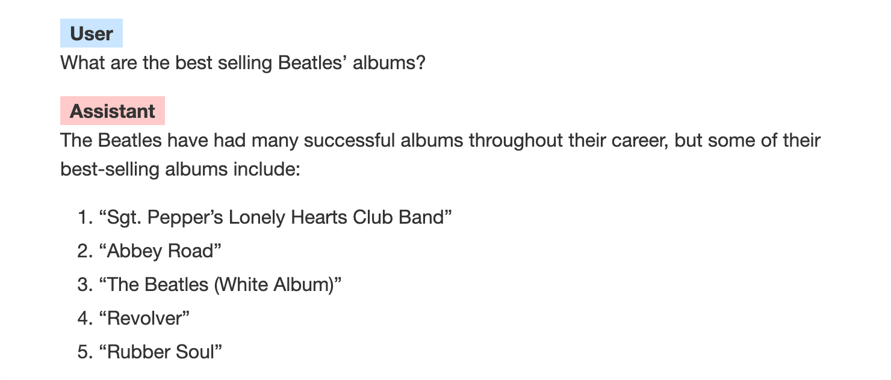</kbd>

<br />

In the `chat` app, OpenAI's large-scale language model acts as a competent assistant that can do anything. It can write computer code, create fiction and poetry texts, and translate texts from one language into another. Of course, it can also engage in casual or academic discussions on specific topics. As with ChatGPT, there can be many variations in the content of the conversation. 

- [`normal` mode template for `chat` app in JSON](https://github.com/yohasebe/monadic-chat/blob/main/apps/chat/chat.json)
- [`research` mode template for `chat` app in Markdown](https://github.com/yohasebe/monadic-chat/blob/main/apps/chat/chat.md)


### Code

Monadic Chat's `code` is designed to be an app that can write computer code for you.

<br />

<kbd>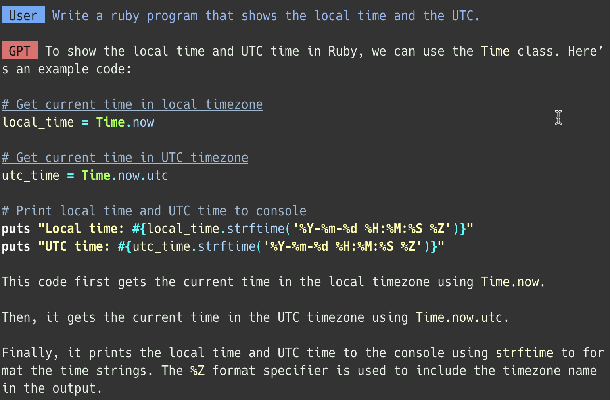</kbd>

<kbd>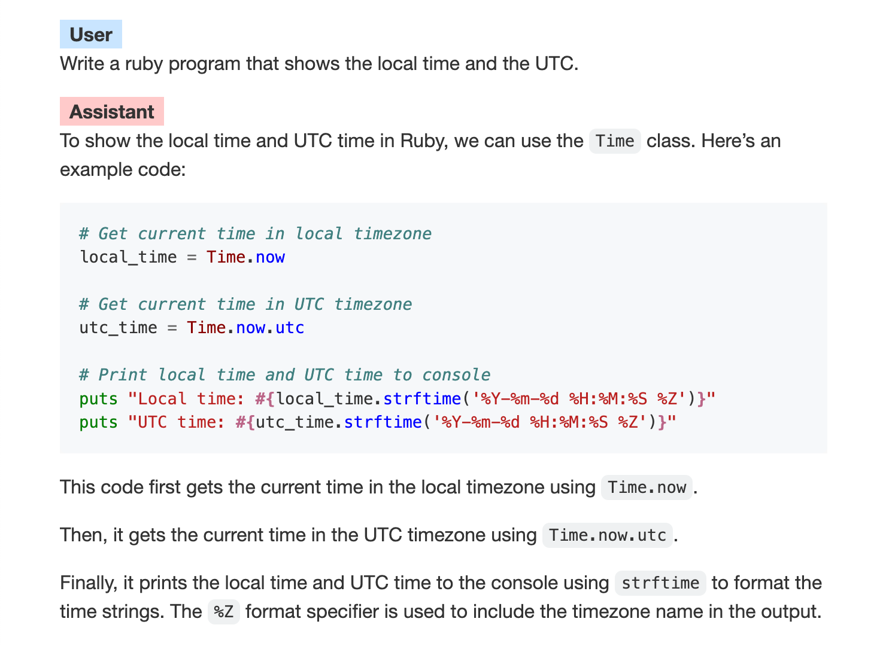</kbd>

<br />

In the `code` app, OpenAI's GPT behaves as a competent software engineer. The main difference from the `chat` app is that the `temperature` parameter is set to `0.0` so that as less randomness as possible is introduced to the responses. Syntax highlighting is applied (where possible) to the program code in the result message. The same applies to the output via the `html` command available from the functions menu.

- [`normal` mode template for `code` app in JSON](https://github.com/yohasebe/monadic-chat/blob/main/apps/code/code.json)
- [`research` mode template for `code` app in Markdown](https://github.com/yohasebe/monadic-chat/blob/main/apps/code/code.md)

### Novel

Monadic Chat's `novel` is designed to help you develop novel plots; the app instructs OpenAI's GPT model to write text based on a topic, theme, or brief description of an event indicated in the user prompt. Each new response is based on what was generated in previous responses. The interactive nature of the app allows the user to control the plot development rather than having an AI agent create a new novel all at once.

- [`normal` mode template for `novel` app in JSON](https://github.com/yohasebe/monadic-chat/blob/main/apps/novel/novel.json)
- [`research` mode template for `novel` app in Markdown](https://github.com/yohasebe/monadic-chat/blob/main/apps/novel/novel.md)

### Translate

Monadic Chat's `translate` is an app that helps translate text written in one language into another. Rather than translating the entire text simultaneously, the app allows users to work sentence by sentence or paragraph by paragraph.

The preferred translation for a given expression is specified in a pair of parentheses ( ) right after the original expression in question in a pair of brackets [ ] in the source text.

<br />

<kbd>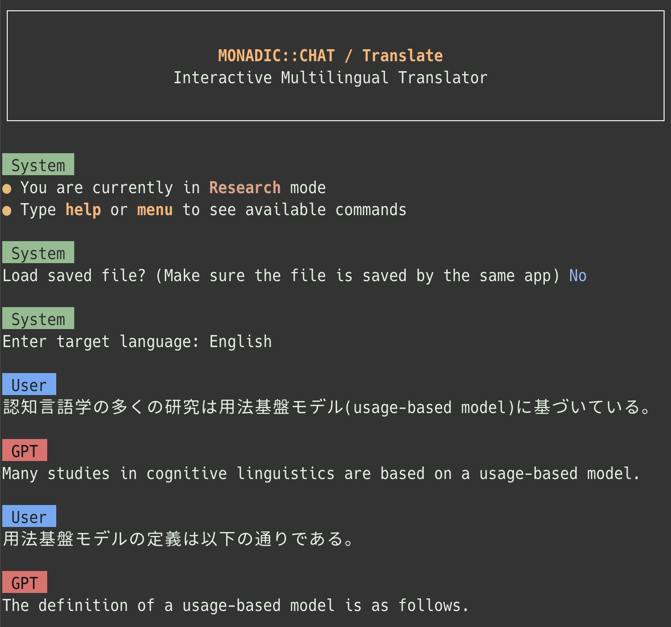</kbd>

<br />

Sometimes, however, problematic translations are created. The user can "save" the set of source and target texts and make any necessary corrections. The same unwanted expressions can be prevented or avoided later by providing the corrected translation data to the app.

- [`normal` mode template for `translate` app in JSON](https://github.com/yohasebe/monadic-chat/blob/main/apps/translate/translate.json)
- [`research` mode template for `translate` app in Markdown](https://github.com/yohasebe/monadic-chat/blob/main/apps/translate/translate.md)

## Modes

Monadic Chat has two modes. The `normal` mode utilizes OpenAI's chat API to achieve ChatGPT-like functionality. It is suitable for using a large language model as a competent companion for various pragmatic purposes. On the other hand, the `research` mode utilizes OpenAI's text-completion API. This mode allows for acquiring **metadata** in the background while receiving the primary response at each conversation turn. It may be especially useful for researchers exploring the possibilities of large-scale language models and their applications.

### Normal Mode

The default language model for `normal` mode is `gpt-3.5-turbo`.

In the default configuration, the dialogue messages are reduced after ten turns by deleting the oldest ones (but not the messages that the `system` role has given as instructions).

### Research Mode

The default language model for `research` mode is `text-davinci-003`.

Although the text-completion API is not a system optimized for chat-style dialogue, it can be used to realize a dialogue system with a mechanism that keeps track of the conversation history in a monadic structure. By default, when the number of tokens in the response from the GPT (which increases with each iteration because of the conversation history) reaches a specific value, the oldest message is deleted. Such a mechanism also has the advantage of retrieving metadata at each dialogue turn.

By default, when the number of tokens in the response from the GPT (which increases with each iteration because of the conversation history) reaches a specific value, the oldest message is deleted.

If you wish to specify how the conversation history is handled as the interaction with the GPT model unfolds, you can write a `Proc` object containing Ruby code. Since various metadata are available in this mode, finer-grained control is possible.

> **Warning**  
> The `research` mode is not intended for general use but for research purposes. You may not get the expected results depending on the template design, parameter settings, and reducer settings. Adjustments in such cases require technical knowledge of OpenAI's text completion API or Ruby.

## What is Research Mode?

Monadic Chat's `research` mode has the following advantages:

- In `research` mode, each turn of the conversation can capture **metadata** as well as the **primary responses**
- You can define the **accumulator** and **reducer** mechanism and control the **flow** of the conversation
- It has structural features that mimic the **monadic** nature of natural language discourse

There are some drawbacks, however:

- It uses OpenAI's `text-davinci-003` model. The response text from this model is less detailed than in the `normal` mode that uses `gpt-3.5-turbo`.
- After displaying a response message from GPT, contextual information is processed in the background, which can cause lag when displaying conversation history in the command line screen or HTML output.
- Templates for `research` mode are larger and more complex, requiring more effort to create and fine-tune.
- `Research` mode requires more extensive input/output data and consumes more tokens than `normal` mode.
- The text-completion API used in `research` mode is more expensive than the chat API used in `normal` mode.

For these reasons, `normal` mode is recommended for casual use as an alternative CLI to ChatGPT. Nevertheless, as described below, the research mode makes Monadic Chat definitively different from other GPT client applications.

### How Research Mode Works

The following is a schematic of the process flow in the `research` mode.

<br />

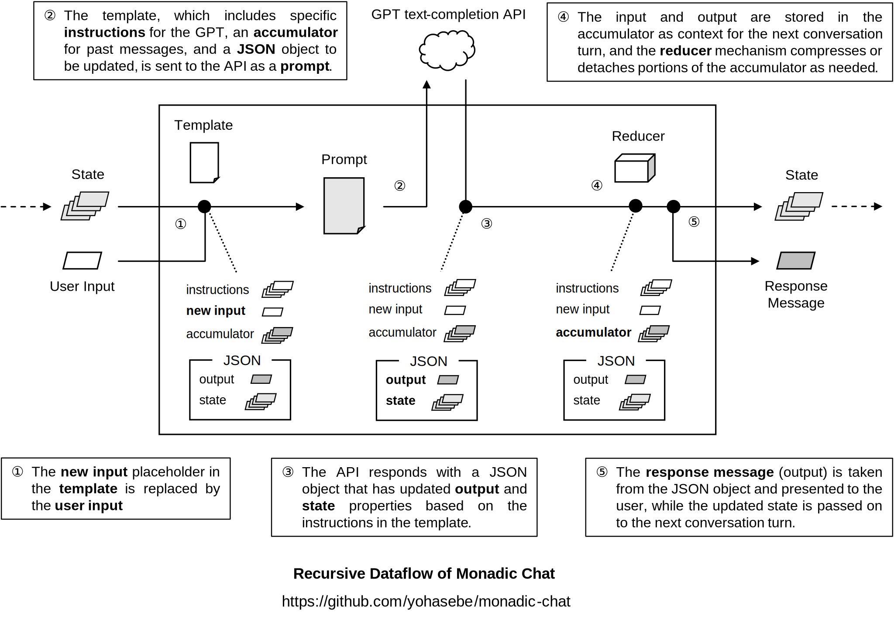

<br />

Terms in bold in it may require more explanation.

- **Input** is a string entered by the user on the command line. The input is filled in the `{{NEW PROMPT}}` placeholder in the template and is sent to the API. 
- The **template** contains conversation data in JSON format and instructions on how the text-completion API should update this data. More details are given in the [Creating New Apps]("#creating-new-apps") section below.
- The term **prompt** can be used in two ways: in one sense, it means text input from the user. In the figure above, however, "prompt" refers to the contents of the template as a whole, which is sent to the API.
- The response to the user’s input is referred to as **output**. Input and output are in the returned JSON object, structured according to the instruction specified in the template.
- The JSON object contains a list of the conversation history, referred to as the **accum** (accumulator) in the figure. Each turn of the conversation increases the messages stored in the accumulator.
- A Monadic Chat app must define a **reducer** to prevent the accumulator from growing excessively.

### Accumulator

`Normal` mode uses OpenAI's chat API, where the following basic structure is used for conversation history management.

```json
{"messages": [
  {"role": "system", "content": "You are a friendly but professional consultant who answers various questions ... "},
  {"role": "user", "content": "Can I ask something?"},
  {"role": "assistant", "content": "Sure!"}
]}
```

The accumulator in `research` mode also looks like this. 

The conversation history is kept entirely in memory until the running app is terminated or reset. The part of the conversation history sent through the API along with new input sentences is referred to here as the accumulator.

### Reducer

The reducer mechanism must be implemented in Ruby code for each application. In many cases, it is sufficient to keep the size of the accumulator within a specific range by deleting old messages when a certain number of conversation turns are reached. Other possible implementations include the following.

**Example 1**

- Retrieve the current conversation topic as metadata at each turn and delete old exchanges if the conversation topic has changed.
- The metadata about the conversation topic is retained in list form even if old messages are deleted.

**Example 2**

- After a certain number of turns, the reducer writes the history of the conversation up to that point to an external file and deletes it from the accumulator.
- A summary of the deleted content is returned to the accumulator as an annotation message by the `system`, and the conversation continues with that summary information as context.

The Ruby implementation of the "reducer" mechanism for each default app can be found below:

- [`apps/chat/chat.rb`](https://github.com/yohasebe/monadic-chat/blob/main/apps/chat/chat.rb)
- [`apps/code/code.rb`](https://github.com/yohasebe/monadic-chat/blob/main/apps/code/code.rb)
- [`apps/novel/novel.rb`](https://github.com/yohasebe/monadic-chat/blob/main/apps/novel/novel.rb)
- [`apps/translate/translate.rb`](https://github.com/yohasebe/monadic-chat/blob/main/apps/translation/translation.rb)

## Creating New App

This section describes how users can create their own original Monadic Chat apps.

As an example, let us create an app named `linguistic`. It will do the following on the user input all at once:

- Return the result of syntactic parsing of the input as a primary response.
- Classify syntactic types of the input ("declarative," "interrogative," "imperative," "exclamatory," etc.)
- Perform sentiment analysis of the input ("happy," "sad," "troubled," "sad," etc.)
- Write text summarizing all the user input up to that point.

The specifications for Monadic Chat's command-line user interface for this app are as follows.

- The text to be parsed must be enclosed in double quotes to prevent the GPT model from misinterpreting it as some instruction. 
- Parsed data will be formatted in Penn Treebank format. However, square brackets [ ] are used instead of parentheses ( ).
- The parsed data is returned as Markdown inline code enclosed in backticks (` `).

> **Note**  
> The use of square brackets (instead of parentheses) in the notation of syntactic analysis here is to conform to the format of [RSyntaxTree](https://yohasebe.com/rsyntaxtree), a tree-drawing program for linguistic research developed by the author of Monadic Chat.
> 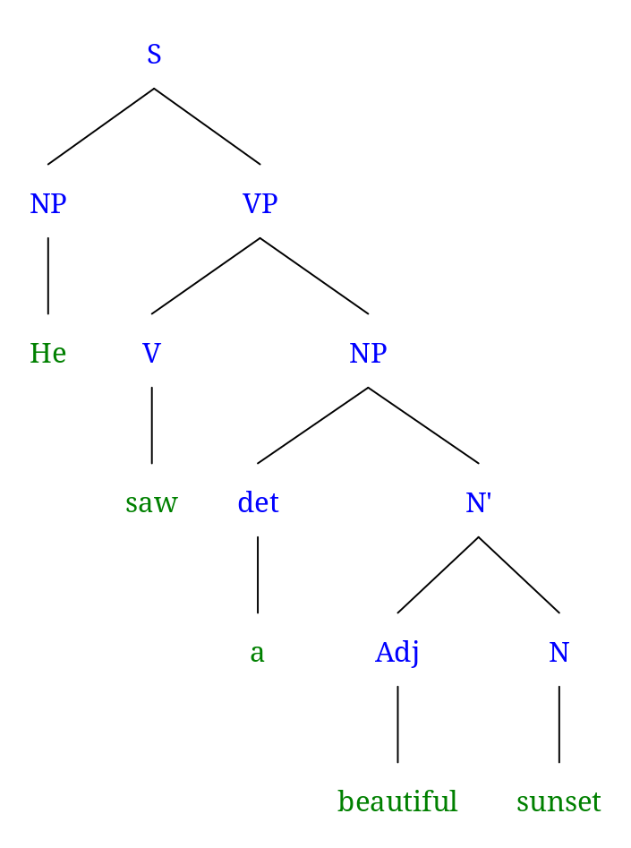

The sample app we create in this section is stored in the [`sample_app`](https://github.com/yohasebe/monadic-chat/tree/main/sample_app) folder in the repository.

Below is a sample HTML displaying the conversation (sentence and its syntactic structure notation pairs) and metadata.

<br />

<kbd>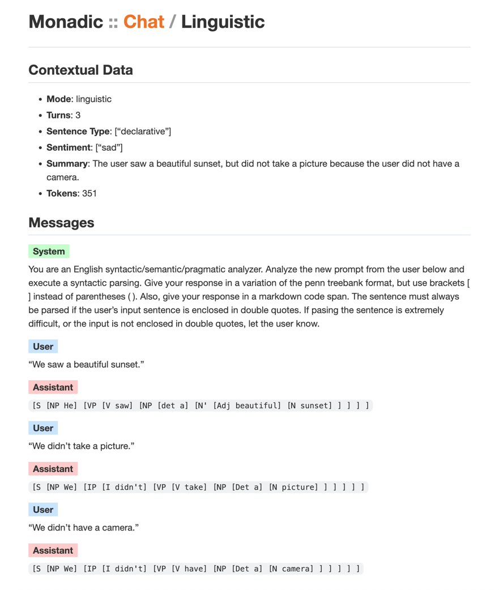</kbd>

<br />


### File Structure

New Monadic Chat apps must be placed inside the `apps` folder. The folders and files for default apps `chat`, `code`, `novel`, and `translate` are also in this folder.

```text
apps
├── chat
│   ├── chat.json
│   ├── chat.md
│   └── chat.rb
├── code
│   ├── code.json
│   ├── code.md
│   └── code.rb
├── novel
│   ├── novel.json
│   ├── novel.md
│   └── novel.rb
└─── translate
    ├── translate.json
    ├── translate.md
    └── translate.rb
```

Notice in the figure above that three files with the same name but different extensions (`.rb`, `.json`, and `.md`) are stored under each of the four default app folders. Similarly, when creating a new app, you create these three types of files under a folder with the same name as the app name.

```text
apps
└─── linguistic
    ├── linguistic.json
    ├── linguistic.md
    └── linguistic.rb
```

The purpose of each file is as follows.

- `linguistic.rb`: Ruby code to define the "reducer"
- `linguistic.json`: JSON template describing GPT behavior in `normal` and `research` modes
- `linguistic.md`: Markdown template describing GPT behavior in addition to the `json` file above in `research` mode

Template files with a name beginning with `_` are also ignored. If a folder has a name beginning with `_`, all its contents are ignored. 

### Reducer Code

We do not need to make the reducer do anything special for the current purposes. So, let's copy the code from the default `chat` app and make a minor modification, such as changing the class name and the app name so that it matches the app name. We save it as `apps/linguistic/linguistic.rb`.

### Monadic Chat Template

In `normal` mode, achieving all the necessary functions shown earlier is impossible or very tough, to say the least. All we do here is display the results of syntactic analysis and define a user interface. Create a JSON file `apps/linguistic/linguistic.rb` and save it with the following contents:

```json
{"messages": [
  {"role": "system",
   "content": "You are a syntactic parser for natural languages. Analyze the given input sentence from the user and execute a syntactic parsing. Give your response in a variation of the penn treebank format, but use brackets [ ] instead of parentheses ( ). Also, give your response in a markdown code span. The sentence must always be parsed if the user's input sentence is enclosed in double quotes."},
  {"role": "user", "content": "\"We saw a beautiful sunset.\""},
  {"role": "assistant",
   "content": "`[S [NP He] [VP [V saw] [NP [det a] [N' [Adj beautiful] [N sunset] ] ] ] ]`"},
  {"role": "user", "content": "\"We didn't take a picture.\"" },
  {"role": "assistant",
   "content": "`[S [NP We] [IP [I didn't] [VP [V take] [NP [Det a] [N picture] ] ] ] ] ]`"}
]}
```

The data structure here is no different from that specified in [OpenAI Chat API](https://platform.openai.com/docs/guides/chat). The `normal` mode of Monadic Chat is just a client application that uses this API to achieve ChatGPT-like functionality on the command line.

### Extra Template for `Research` Mode

In the `research` mode, you can obtain metadata at each turn as you progress through an interactive conversation with GPT. Compressing and modifying the conversation history based on the metadata (or any other data) is also possible. However, you must create an extra template besides the `normal` mode JSON template.

This extra template for `research` mode is a Markdown file comprising six sections. The role and content of each section are shown in the following figure.

<br />


<br />

Below we will look at the `research` mode template for the `linguistic` app, section by section.

**Main Section**

<div style="highlight highlight-source-gfm"><pre style="white-space : pre-wrap !important;">{{SYSTEM}

All prompts by "user" in the "messages" property are continuous in content.You are an English syntactic/semantic/pragmatic analyzer. Analyze the new prompt from the user below and execute a syntactic parsing. Give your response in a variation of the penn treebank format, but use brackets [ ] instead of parentheses ( ). Also, give your response in a markdown code span. The sentence must always be parsed if the user's input sentence is enclosed in double quotes. Let the user know if parsing the sentence is difficult or the input must be enclosed in double quotes. 

Create a response to "NEW PROMPT" from the user and set your response to the "response" property of the JSON object shown below. The preceding conversation is stored in "PAST MESSAGES". In "PAST MESSAGES", "assistant" refers to you.</pre></div>

Some of the text here is the same as the text of the directive message by `system` in the template in `normal` mode; Monadic Chat automatically replaces `{{SYSTEM}}} with the `system` directive text when the template is sent via API. However, the above text also includes a few additional paragpraphs, including the one instructing the response from GPT to be presented as a JSON object.

**New Prompt**

```markdown
NEW PROMPT: {{PROMPT}}
```

Monadic Chat replaces `{{PROMPT}}` with input from the user when sending the template through the API.

**Past Messages**

```markdown
PAST MESSAGES:
{{MESSAGES}}
```

Monadic Chat replaces `{{MESSAGES}}` with messages from past conversations when sending the template. Note that not all the past messages have to be copied here: the reducer mechanism could select, modify, or even "generate" messages and include them instead.

**JSON Object**

```json
{
  "prompt": "\"We didn't have a camera.\"",
  "response": "`[S [NP We] [VP [V didn't] [VP [V have] [NP [Det a] [N camera] ] ] ] ] ]`\n\n###\n\n",
  "mode": "linguistic",
  "tokens": 351
  "turns": 3,
  "sentence_type": ["declarative"],
  "sentiment": ["sad"],
  "summary": "The user saw a beautiful sunset, but did not take a picture because the user did not have a camera.",
}
```

This is the core of the `research` mode template.

Note that the entire `research` mode template is written in Markdown format, so the above JSON object is actually separated from the rest of the template by a code fence, as shown below.

```json
 ```json
 {
   "prompt": ...
   "response": ...
   "mode": ...
   "tokens": ...
   "turns": ...
   ...
 }
 ```
```

The required properties of this JSON object are `prompt`, `response`, `mode`, and `tokens`. Other properties are optional. The `mode` property is used to check the app name when saving the conversation data or loading from an external file. The `tokens` property is used in the reducer mechanism to check the approximate size of the current JSON object. The `turns` property is also used in the reducer mechanism.

The JSON object in the `research` mode template is saved in the user’s home directory (`$HOME`) with the file `monadic_chat.json`. The content is overwritten every time the JSON object is updated. Note that this JSON file is created for logging purposes (so the data is not pretty printed). Modifying its content does not affect the processes carried out by the app.

**Content Requirements**

```markdown
Make sure the following content requirements are all fulfilled:

- keep the value of the "mode" property at "linguistic"
- set the new prompt to the "prompt" property
- create your response to the new prompt based on "PAST MESSAGES" and set it to "response"
- analyze the new prompt's sentence type and set a sentence type value such as "interrogative", "imperative", "exclamatory", or "declarative" to the "sentence_type" property
- analyze the new prompt's sentiment and set one or more sentiment types such as "happy", "excited", "troubled", "upset", or "sad" to the "sentiment" property
- summarize the user's messages so far and update the "summary" property with a text of fewer than 100 words using as many discourse markers such as "because", "therefore", "but", and "so" to show the logical connection between the events.
- update the value of "tokens" with the number of tokens of the resulting JSON object"
- increment the value of "turns" by 1
```

Note that all the properties of the JSON object above are mentioned so that GPT can update them accordingly.

**Formal Requirements**

```markdown
Make sure the following formal requirements are all fulfilled:

- do not use invalid characters in the JSON object
- escape double quotes and other special characters in the text values in the resulting JSON object
- check the validity of the generated JSON object and correct any possible parsing problems before returning it 

Add "\n\n###\n\n" at the end of the "response" value.

Wrap the JSON object with "<JSON>\n" and "\n</JSON>".
```

This section details the format of the response returned through the API. JSON is essentially text data, and some characters must be escaped appropriately.

Due to their importance, two formal requirements are described as independent sentences rather than in list form. It is necessary since the language model available in OpenAI’s text-completion API is subject to some indeterminacy (even when the `temperature` parameter is `0.0`).

- To ensure that a valid JSON object is retrieved, Monadic Chat requires `< JSON>... </JSON>` tags to enclose the whole JSON data.
- Monadic Chat requires that the primary response from GPT end with the string `\n\n####\n\n`. This is part of the mechanism to detect when the response string has reached the end so that it can be displayed on the terminal as soon as possible.

## What is Monadic about Monadic Chat?

A monad is a type of data structure in functional programming (leaving aside for the moment the notion of the monad in mathematical category theory). An element with a monadic structure can be manipulated in a certain way to change its internal data. However, no matter how much the internal data changes, the external structure of the monadic process remains the same and can be manipulated in the same way as it was at first.

Many such monadic processes surround us, and natural language discourse is one of them. A "chat" between a human user and an AI agent can be thought of as a form of natural language discourse, which is monadic in nature. If so, an application that provides an interactive interface to a large-scale language model, such as ChatGPT, would most naturally be designed in a "functional" way, considering the monadic nature of natural language discourse.

### Unit, Map, and Join

Many “functional” programming languages, such as Haskell, have monads as a core feature. However, Monadic Chat is developed using the Ruby programming language, which does not. This is because, with Ruby, it will be easier for users to write their apps. Ruby is not classified as a "functional language" per se. Still, Monadic Chat has the following three features required of a monad, and in this sense, it can be considered "monadic."

- **unit**: a monadic process has a means of taking data and enclosing it in a monadic structure
- **map**: a monadic process has a means of performing some operation on the data inside a monadic structure and returning the result in a monadic structure
- **join**: a monadic process has a means of flattening a structure with multiple monadic layers into a single monadic layer

### Discourse Management Object

In Monadic Chat's `research` mode, the discourse management object described in JSON serves as an environment to keep a conversation going between the user and the large language model. Any sample/past interaction data can be wrapped inside such an environment (***unit***).

The interaction between the user and the AI can be interpreted as an operation on the *discourse world* built in the previous conversational exchanges. Monadic Chat updates the discourse world by retrieving the conversation history embedded in the template and performing operations responding to user input (***map***).

Responses from OpenAI's language model APIs (chat API and text-completion API) are also returned in the same JSON format. The main conversational response content is wrapped within this environment. If the whole object were treated as the conversational response to the user input, the discourse management object would involve a nested structure, which could continue inifinitely. Therefore, Monadic Chat extracts only the necessary values from the response object and reassembles the (single-layered) discourse management object using them (***join***).

<br />

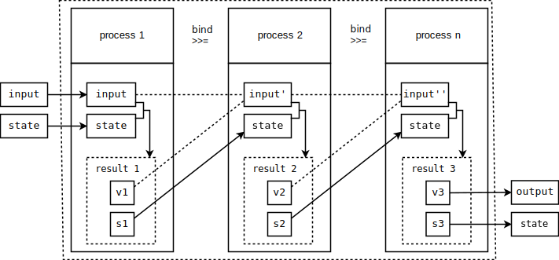

<br />

The architecture of the `research` mode of Monadic Chat--with its capability of generating and managing metadata properties inside a monadic structure--is parallel to the architecture of natural language discourse in general: They both can be seen as a kind of "state monad" (Hasebe 2021).

## Future Plans

- More test cases to verify command line user interaction behavior
- Improved error handling mechanism to catch incorrect responses from GPT
- Develop a DSL to define templates in a more efficient and systematic manner
- Develop scaffolding capabilities to build new apps quickly 

## Bibliographical Data

Please use one of the following Bibtex entries when referring to Monadic Chat or the underlying concepts.

```
@inproceedings{hasebe_2023j,
  author = {長谷部陽一郎},
  title = {Monadic Chat：テキスト補完APIで文脈を保持するためのフレームワーク},
  booktitle = {言語処理学会第29回年次大会発表論文集},
  url = {https://www.anlp.jp/proceedings/annual_meeting/2023/pdf_dir/Q12-9.pdf},
  year = {2023},
  pages = {3138--3143}
}

@inproceedings{hasebe_2023e,
  author = {Yoichiro Hasebe},
  title = {Monadic Chat: Framework for managing context with text completion API},
  booktitle = {Proceedings of the 29th annual meeting of the Association for Natural Language Processing},
  url = {https://www.anlp.jp/proceedings/annual_meeting/2023/pdf_dir/Q12-9.pdf},
  year = {2023},
  pages = {3138--3143}
}

@phdthesis{hasebe_2021,
  author = {Yoichiro Hasebe},
  title = {An Integrated Approach to Discourse Connectives as Grammatical Constructions},
  school = {Kyoto University},
  url = {https://repository.kulib.kyoto-u.ac.jp/dspace/bitstream/2433/261627/2/dnink00969.pdf},
  year = {2021}
}

```

## Acknowledgments

This work was partially supported by JSPS KAKENHI Grant Number JP18K00670.

## Contributing

Bug reports and pull requests are welcome on GitHub at [https://github.com/yohasebe/monadic_chat]([https://github.com/yohasebe/monadic_chat]).

## Author

Yoichiro HASEBE 

[yohasebe@gmail.com](yohasebe@gmail.com)

## License

The gem is available as open source under the terms of the [MIT License](https://opensource.org/licenses/MIT).

